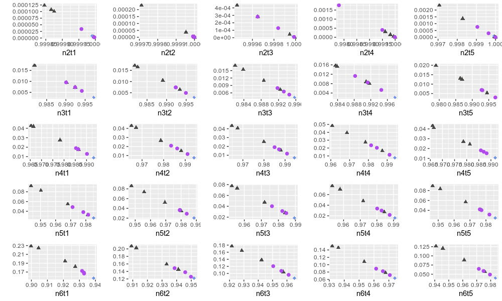

# PolsarTimeSeries
This repository contains functions to analysis of SAR images using Bandit and Pompe. 

The SAR data is available on https://drive.google.com/file/d/1-tBmid6Lz_ps_L3OpVVnoR64cENGzR1O/view?usp=sharing and correspond to HHHH band of an image taken from the Sierra del Lacandon National Park, Guatemala (acquired Apr 10, 2015) avalilable on https://uavsar.jpl.nasa.gov/cgi-bin/product.pl?jobName=Lacand_30202_15043_006_150410_L090_CX_01#data

Initially, eight regions were analyzed, following the following configurations:

* All have dimension 200x200

* Four regions correspond to forest regions in Guatemala

* One region corresponds to crop regions in Guatemala

* The other three regions correspond to terrestrial regions that are characterized by not being uniform

In this way, we apply the probability distribution of Bandt and Pompe to two-dimensional data, testing several dimension and delay values. Finally, we evaluate the implication of the modification of these parameters in the process of characterizing these data in the Entropy-Complexity plane, as we can analyze below.

As we can see, the best results obtained by this parameter change were when the following characteristics were applied:

* Dimension 4 and delay 5

* Dimension 6 and delay 1
